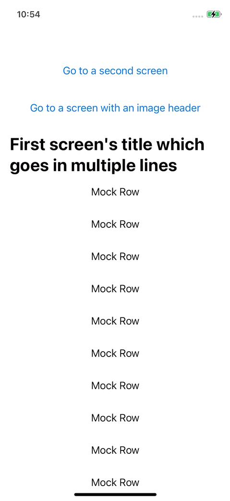

# ScrollingLazyVStack Demo

Demo project showing how to use ScrollingLazyVStack.

ScrollingLazyVStack is a custom LazyVStack that supports:
* multiple lines large title
* an optional custom header that sits between the navigation bar and the title
  * it can be any kind of View

This demo project also shows how to hide back button text on the pushed screen.

